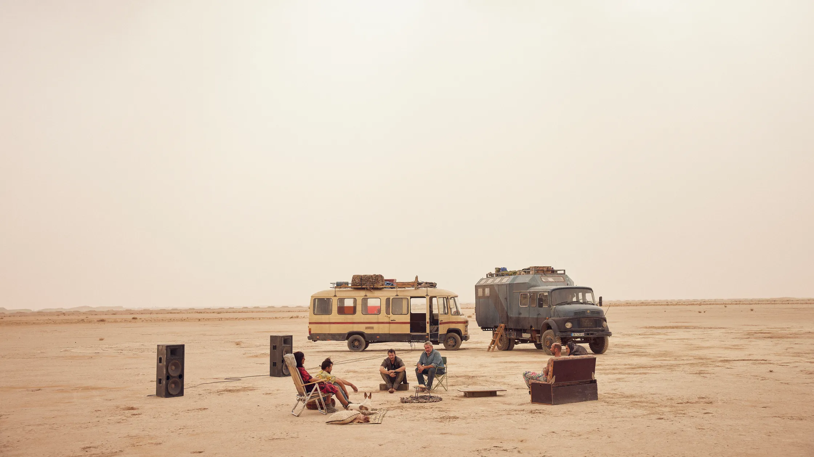

<small>Image credit: Still from <em>Sirāt</em> (Óliver Laxe, 2025)</small>

[Sirāt: Deserts Are Not Empty](projects/sirat)\
Paper proposal, in progress.

[<i class="fa-solid fa-envelope" role="img" aria-label="Email"></i>](mailto:mroberts1@gmail.com) \| [<i class="fa-brands fa-mastodon" role="img" aria-label="Mastodon"></i>](https://merveilles.town/@dokoissho) \| [<i class="fa-brands fa-github" role="img" aria-label="GitHub"></i>](https://github.com/mroberts1/) \| [<i class="fa-brands fa-twitter" role="img" aria-label="Twitter"></i>](https://twitter.com/mroberts_vma)
